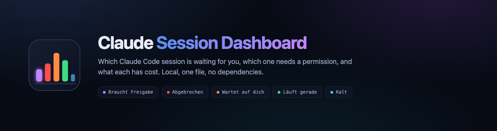
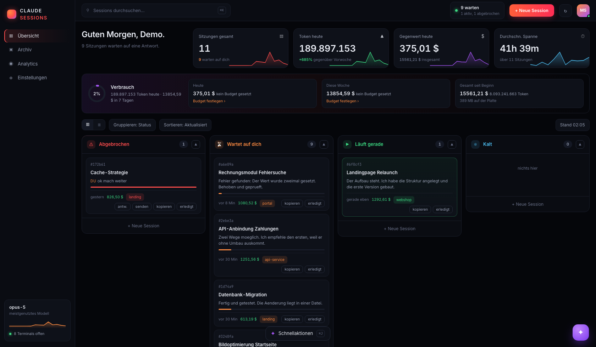

<p align="center">
  
</p>

<p align="center">
  <a href="https://github.com/gotakt/gotakt-claude-dashboard/actions/workflows/pruefung.yml">
    </a>
  
  
  
  
  
</p>

A local dashboard for your Claude Code sessions. It reads the transcripts Claude Code
already writes, listens to its hooks, and shows which session is waiting for you, which
one needs a permission, which one stopped mid-turn, and what each has cost.

Built because I kept running six terminals at once and losing track of where I stopped.

<p align="center">
  
</p>

<p align="center"><sub>Demo mode, so every title and message is a placeholder.</sub></p>

---

## Five states, and where each one comes from

| | State | Source |
|---|---|---|
| 🟣 | **Braucht Freigabe** | `PermissionRequest` — Claude is waiting for you to approve a tool |
| 🔴 | **Abgebrochen** | `StopFailure`, or the transcript's last message is yours |
| 🟠 | **Wartet auf dich** | `Stop` — Claude finished its turn |
| 🟢 | **Läuft gerade** | `UserPromptSubmit` / `PreToolUse`, with the tool name shown |
| 🔵 | **Kalt** | `SessionEnd`, or nothing happened for over a week |

Hooks are the truth while they are fresh. When they go missing — a crash, a `SIGKILL`,
no hooks installed at all — the dashboard falls back to reading the transcript and its
modification time. Every card says which of the two it used: **HOOK** or **hergeleitet**.

## What you can do from it

- **Click a card** and the matching Terminal window and tab comes to the front. No window
  open? A new one starts with `claude -r <id>`.
- **Answer without a terminal** on crashed or cold sessions, via `claude -r -p`. Refused
  when a Terminal tab matches the session, and refused again when two tabs carry the same
  title — the dashboard would rather do nothing than write into the wrong session.
- **Cost and tokens** summed from the `usage` field of every message, per model, against
  a price table you can edit.
- **Budget** for today and this week, with a ring that turns orange and then red.
- **Archive** for sessions you are done with, and a trash that moves transcripts aside
  and can put them back.
- **Keyboard**: `j` `k` move, `Enter` opens, `e` archives, `/` or `⌘K` searches,
  `⌘J` shows the numbers.

## Install

```bash
git clone https://github.com/gotakt/gotakt-claude-dashboard.git
cd gotakt-claude-dashboard
./install.sh
```

That is the whole setup. The script finds `python3`, `claude` and the repository itself,
writes a LaunchAgent, registers the hooks and starts the service on
<http://localhost:8787>. `KeepAlive` is on, so it comes back if it dies.

Prefer to run it by hand?

```bash
python3 dash.py --serve        # server on :8787
python3 dash.py                # read-only snapshot, no actions
python3 dash.py --demo         # same, every name and message replaced
```

Removing it again. Three steps, and the third one matters: the installer also
writes hook entries into `~/.claude/settings.json`, and those point at this
repository. Leave them behind, delete the folder, and every Claude Code session
afterwards runs a hook that is no longer there.

```bash
launchctl bootout gui/$(id -u)/de.gotakt.claude-dashboard
rm ~/Library/LaunchAgents/de.gotakt.claude-dashboard.plist
python3 hooks/install-hooks.py --entfernen
```

Run the third one from the repository, before you delete it. It removes only
the entries that call this repository's `lifecycle.py` and leaves every other
hook in the same event untouched; it writes a timestamped backup first, and it
does nothing at all if there is nothing of ours to remove.

## Requirements

macOS, because window handling goes through AppleScript and Terminal.app.
Python 3.9 or newer, standard library only.
Claude Code, with at least one session in `~/.claude/projects`.

## Documentation

| | |
|---|---|
| [Architecture](docs/ARCHITECTURE.md) | how state is resolved, what the cache does, where the files live |
| [Security model](docs/SECURITY.md) | the trust boundary, what is stored, what leaves the machine |
| [Hooks](docs/HOOKS.md) | which events are used and what each one writes |

## Where the guarantees stop

The interface is in German. Terminal.app only, iTerm2 and friends are not wired up.
Cloud and Remote Control sessions do not appear, because their transcripts live on a
server and not on your machine. Your remaining usage quota is not shown for the same
reason — Claude Code fetches it when you run `/usage` and never stores it, which is why
the budget is one you set yourself.

## Licence

MIT
